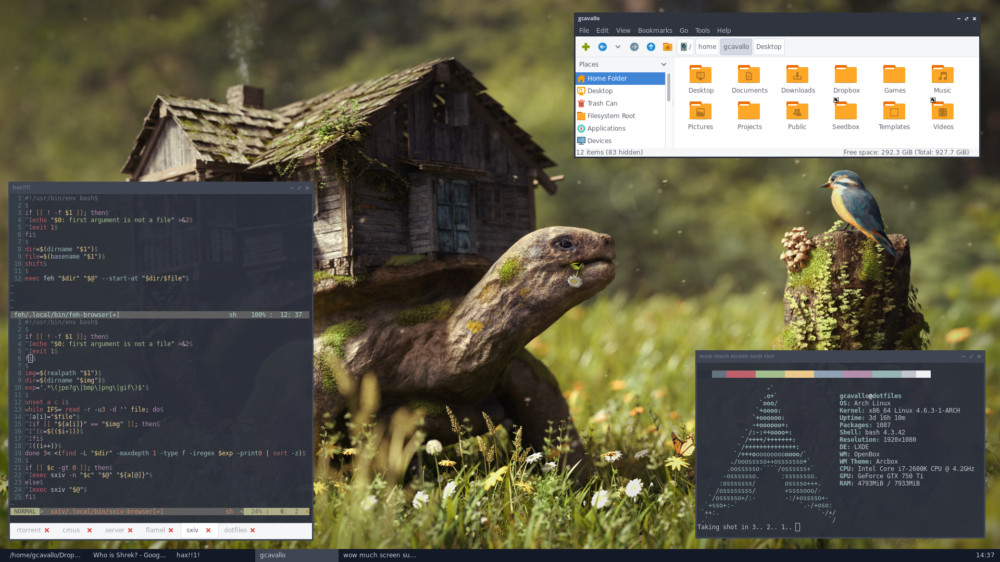

My GNU/Linux desktop dotfiles
=============================

Configured packages
-------------------

* bash
* compton
* conky
* feh
* fontconfig
* git
* gtk
* mpv
* openbox
* pacaur
* pacman
* profile
* sxiv
* tint2
* vim
* xprofile

Install
-------

	./stow <pkgname>

Uninstall
---------

	./stow -D <pkgname>

License
-------

BSD 3-Clause License

See LICENSE file included, or http://opensource.org/licenses/BSD-3-Clause
