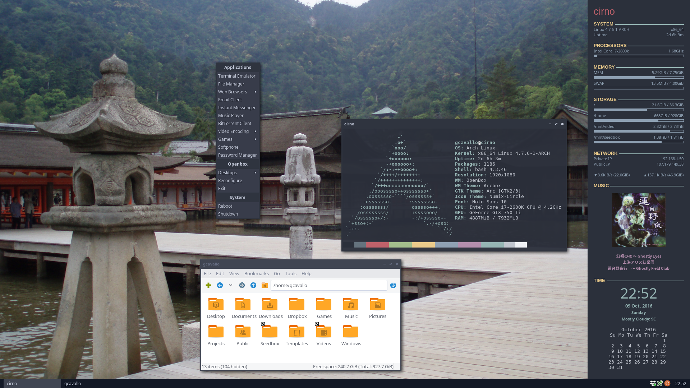

My GNU/Linux desktop dotfiles
=============================

Configured packages
-------------------

* bash
* geany
* mpv
* vim
* xfce4-panel
* xfce4-terminal
* xterm

License
-------

BSD 3-Clause License

See LICENSE file included, or http://opensource.org/licenses/BSD-3-Clause
